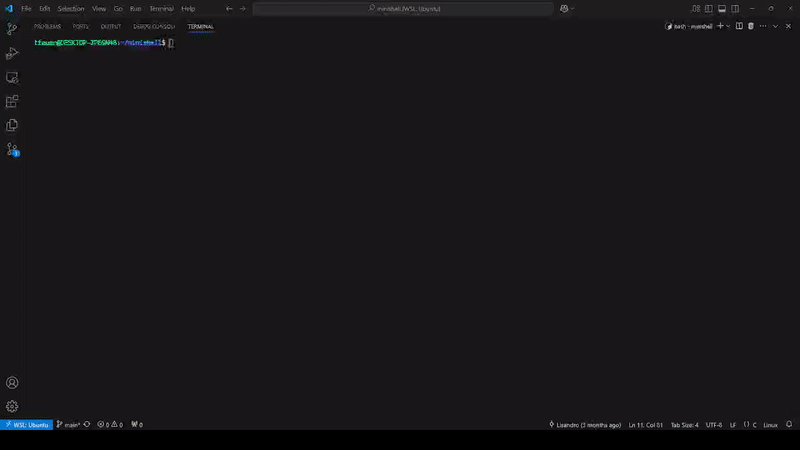

# Welcome to MiniShared 🤜🤛

[](assets/minishell_video.mkv)

# Usage

Clone this repository:

```git clone https://github.com/minishelling/minishell.git minishell```

Compile the project:

```cd minishell && make```

And then run the program:

```./minishell```

For debug mode, run:

```./minishell -d```

